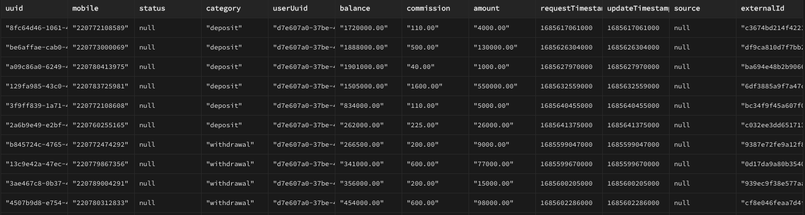
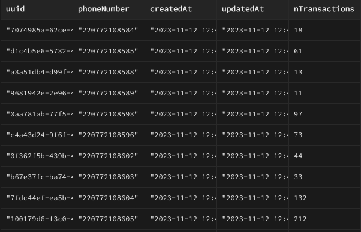
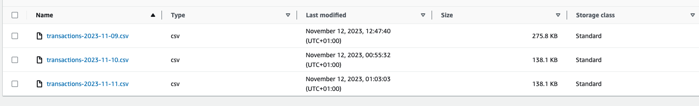
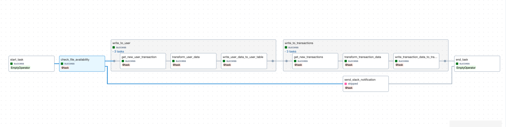
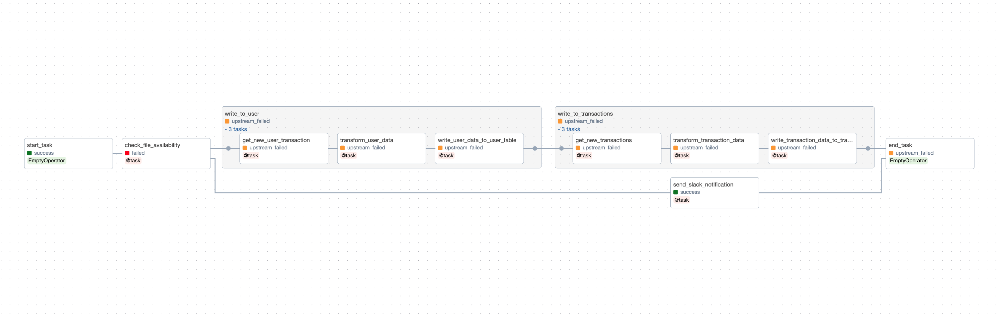
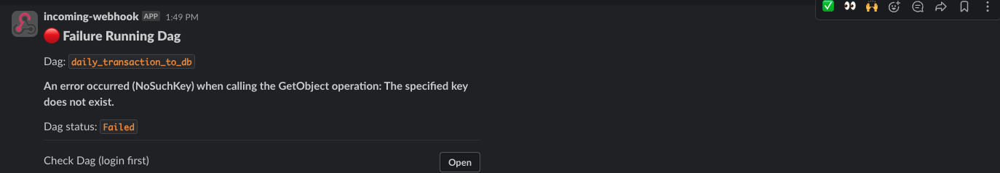
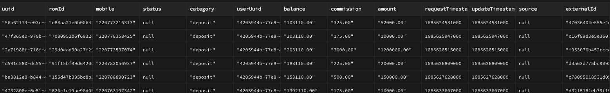
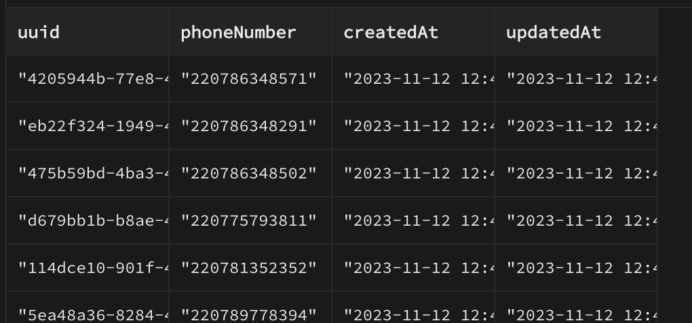

# Project Overview
This repository houses essential tests and data processing scripts. This project comprises two key components: **Test1** and **Test2**.

## Test1
This section encapsulates scripts dedicated to extracting CSV files from the local file system and seamlessly transferring them into a PostgreSQL database.
### Transaction Data

### User Data

## Test2
The second component orchestrates an Airflow DAG designed to execute a sequence of data operations. This DAG operates on a daily schedule, retrieving data from an S3 bucket, preprocessing it, and storing the results in a database.

### DAG Schedule
The DAG triggers daily at 9 AM. If the necessary file is not yet present in S3 during execution, the DAG retries every 30 minutes until 1 PM. Upon reaching 1 PM without success, the task fails, triggering a Slack notification to report the error.

### Database Operations
The DAG populates two tables: `users` and `transactions`. To ensure idempotency, the DAG utilizes upsert operations and constraints to only write new data. 

- **User Table:** The `phoneNumber` column serves as a unique identifier, distinguishing between new and existing data during upsert. The `nTransaction` column is intentionally excluded from the table to maintain idempotency.

- **Transaction Table:** 
 a primary key and a composite key (utilizing `requestTimestamp` `agentPhoneNumber` `externalId`) called `rowId`, this table enforces the insertion of new records only, preventing duplicates. The composite key is a MD5 hash value.

## Project Data

### Successful DAG Run

### Failed DAG Run

### Transaction Data

### User Data

Note: Ignore the double quotes in the data representation; each column adheres to its respective data type.
